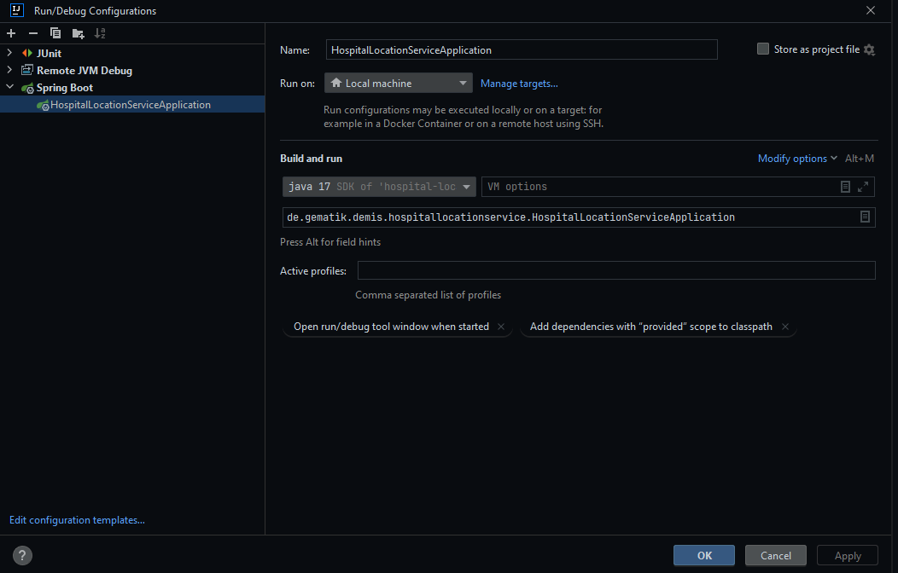

 <br/>

# Hospital-Location-Service

<details>
  <summary>Table of Contents</summary>
  <ol>
    <li>
      <a href="#about-the-project">About The Project</a>
       <ul>
        <li><a href="#quality-gate">Quality Gate</a></li>
        <li><a href="#release-notes">Release Notes</a></li>
      </ul>
	</li>
    <li>
      <a href="#getting-started">Getting Started</a>
      <ul>
        <li><a href="#test">Test</a></li>
        <li><a href="#docker">Docker</a></li>
        <li><a href="#local">Local</a></li>
      </ul>
    </li>
    <li><a href="#endpoints">Endpoints</a></li>
    <li><a href="#data-origin">Data origin</a></li>
    <li><a href="#usage">Usage</a></li>
    <li><a href="#cucumber-integrationtests">Cucumber Integrationtests</a></li>
    <li><a href="#security-policy">Security Policy</a></li>
    <li><a href="#contributing">Contributing</a></li>
    <li><a href="#license">License</a></li>
    <li><a href="#contact">Contact</a></li>
  </ol>
</details>

## About the Project

This service provides information for hospital location data. For any valid IK-Number it provides a list of allowed/registered/known hospitals and the addresses of those.

### Quality Gate
[](https://sonar.prod.ccs.gematik.solutions/dashboard?id=de.gematik.demis%3Ahospital-location-service)|[](https://sonar.prod.ccs.gematik.solutions/dashboard?id=de.gematik.demis%3Ahospital-location-service)|[](https://sonar.prod.ccs.gematik.solutions/dashboard?id=de.gematik.demis%3Ahospital-location-service)|[](https://sonar.prod.ccs.gematik.solutions/dashboard?id=de.gematik.demis%3Ahospital-location-service)|[](https://sonar.prod.ccs.gematik.solutions/dashboard?id=de.gematik.demis%3Ahospital-location-service)|[](https://sonar.prod.ccs.gematik.solutions/dashboard?id=de.gematik.demis%3Ahospital-location-service)

[](https://sonar.prod.ccs.gematik.solutions/dashboard?id=de.gematik.demis%3Ahospital-location-service)

### Release Notes

See [ReleaseNotes](ReleaseNotes.md) for all information regarding the (newest) releases.


## Getting Started

### Test
Hint:  
the test-locations.json contains specific test data.  
The test locations belong to the ik numbers `987654321 & 098765432`.  
```
mvn clean verify
```

### Docker

build image with

```docker 
docker build -t hospital-location-service:latest .
```
the image can alternatively also be built with maven:
```docker
mvn clean install -Pdocker
```

run image as container `docker run -p 8083:8083 -dt --name hls-container hospital-location-service:latest`

### Local
in IntelliJ as SpringBoot Application


## Endpoints

`/status` get Endpunkt für Statusmeldung (aktuell minimal implementiert)

`/hospital-locations?ik=` Get Endpunkt für die Abfrage von Krankhausstandorten

`/actuator/health/` Standardenpunkt vom Actuator

`/actuator/health/liveness` Standardenpunkt vom Actuator

`/actuator/health/readiness` Standardenpunkt vom Actuator


## Data origin

Usualy the origin of the InEK data is <https://krankenhausstandorte.de/xml/latest>.

This file is currently stored in `src/main/resources` and it must be registered in the `src/main/resources/application.properties` file.

## Usage

### Intellij/cmd

Start the spring boot server with: `mvn clean spring-boot:run`
Check the server with: `curl -v localhost:8082/status`

## Cucumber Integrationtests
Execute with 'mvn verify' or in Intellij with start button
Report will be generated and saved under target/cucumber

## Security Policy

If you want to see the security policy, please check our [SECURITY.md](.github/SECURITY.md).

## Contributing

If you want to contribute, please check our [CONTRIBUTING.md](.github/CONTRIBUTING.md).

## License
EUROPEAN UNION PUBLIC LICENCE v. 1.2

EUPL © the European Union 2007, 2016

Following terms apply:

1. Copyright notice: Each published work result is accompanied by an explicit statement of the license conditions for use. These are regularly typical conditions in connection with open source or free software. Programs described/provided/linked here are free software, unless otherwise stated.

2. Permission notice: Permission is hereby granted, free of charge, to any person obtaining a copy of this software and associated documentation files (the "Software"), to deal in the Software without restriction, including without limitation the rights to use, copy, modify, merge, publish, distribute, sublicense, and/or sell copies of the Software, and to permit persons to whom the Software is furnished to do so, subject to the following conditions::

    1. The copyright notice (Item 1) and the permission notice (Item 2) shall be included in all copies or substantial portions of the Software.

    2. The software is provided "as is" without warranty of any kind, either express or implied, including, but not limited to, the warranties of fitness for a particular purpose, merchantability, and/or non-infringement. The authors or copyright holders shall not be liable in any manner whatsoever for any damages or other claims arising from, out of or in connection with the software or the use or other dealings with the software, whether in an action of contract, tort, or otherwise.

    3. The software is the result of research and development activities, therefore not necessarily quality assured and without the character of a liable product. For this reason, gematik does not provide any support or other user assistance (unless otherwise stated in individual cases and without justification of a legal obligation). Furthermore, there is no claim to further development and adaptation of the results to a more current state of the art.

3. Gematik may remove published results temporarily or permanently from the place of publication at any time without prior notice or justification.

4. Please note: Parts of this code may have been generated using AI-supported technology.’ Please take this into account, especially when troubleshooting, for security analyses and possible adjustments.

See [LICENSE](LICENSE.md).

## Contact

E-Mail to [DEMIS Entwicklung](mailto:demis-entwicklung@gematik.de?subject=[GitHub]%20Hospital-Location-Service)